## H1: Exact methods for solving a system of linear equations
**Problem**: using exact solution methods, solve a system of linear equations.<br>
**Note**: all scripts generate matrices with random values and draw graphs of time versus size automatically.
### Solution 1: Gaussian elimination
Gaussian elimination is performed in two steps: a forward elimination and a back substitution.<br>
**Step 1**. By elementary row operations, bring the matrix to the upper triangular form. First step reduces a given system to *row echelon* form, from which one can tell whether there are no solutions, a unique solution, or infinitely many solutions.<br>
**Step 2**. Continue to use row operations until the solution is found; in other words, second step puts the matrix into *reduced row echelon* form.<br>
**Code**:
```python
# A is a square matrix;
# f is a vector of numbers on the right side of equalities;
# x is a solution vector.
def gauss(A, f):
    for k in range(n):
        A[k, k + 1:] /= A[k, k]
        f[k] /= A[k][k]
        for i in range(k + 1, n):
            A[i, k + 1:] -= A[i][k] * A[k, k + 1:]
            f[i] -= A[i][k] * f[k]
        A[k + 1:, k] = np.zeros(n - k - 1)
    x = np.zeros(n)
    for i in range(n - 1, -1, -1):
        x[i] = f[i]
        for j in range(i + 1, n):
            x[i] -= A[i][j] * x[j]
    return x
```
Running:
```
python3 gauss.py
```
Comparison of the speed of the self-writing function and the library function:<br>
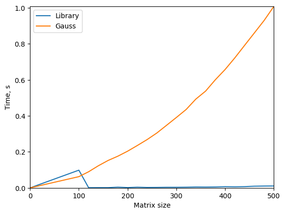
### Solution 2: tridiagonal matrix algorithm (Thomas algorithm, sweep)
This algorithm is a simplified form of Gaussian elimination that can be used to solve tridiagonal systems of equations. A tridiagonal system for *n* unknowns may be written as<br>
<br>
where  and .<br>

<br>
**Step 1.** Find the coefficients through which all  are expressed linearly through each other:<br>
<br>
After some calculations we get the formulas:<br>
<br>
**Step 2.** Use back substitution to find an answer:<br>
<br>
**Code:**<br>
```python
def sweep(a, b, c, d):
    alpha = np.zeros(n + 1)
    beta = np.zeros(n + 1)
    for i in range(n):
        k = a[i] * alpha[i] + b[i]
        alpha[i + 1] = -c[i] / k
        beta[i + 1] = (d[i] - a[i] * beta[i]) / k
    x = np.zeros(n)
    x[n - 1] = beta[n]
    for i in range(n - 2, -1, -1):
        x[i] = alpha[i + 1] * x[i + 1] + beta[i + 1]
    return x
```
Running:
```
python3 sweep.py
```
Comparison of the speed of the self-writing function and the library function:<br>
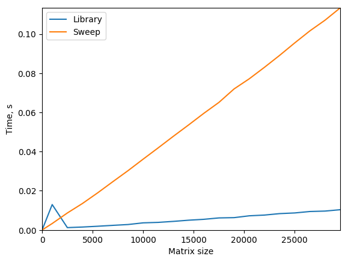
### Solution 3: Cholesky decomposition
The solution of  is reduced to the solution  and .<br>
**Step 1**. Matrix  is first filled with zeros, and then filled with values and becomes upper triangular through the formula:<br>
<br>
<br>
**Step 2**. Then two systems, given at the beginning, are solved using back substitution. <br>
**Code (calculating matrix S):**<br>
```python
def get_s(a, n):
    s = np.zeros((n, n))
    for i in range(n):
        sq_sum = 0.0
        for k in range(i):
            sq_sum += s[k, i] ** 2
        s[i, i] = (a[i, i] - sq_sum) ** 0.5
        for j in range(i + 1, n):
            s_sum = 0.0
            for k in range(i):
                s_sum += s[k, i] * s[k, j]
            s[i, j] = (a[i, j] - s_sum) / s[i, i]
    return s
```
Running:
```
python3 cholesky.py
```
Comparison of the speed of the self-writing function and the library function:<br>
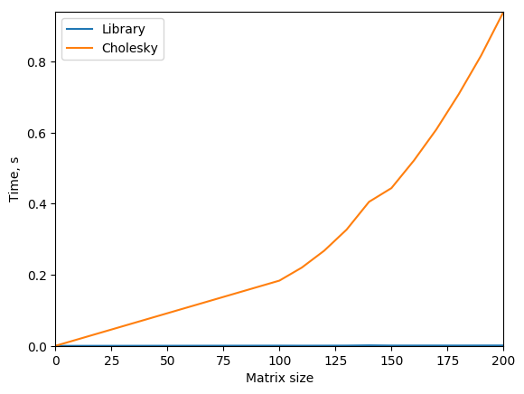

## H2: Iterative methods for solving a system of linear equations
**Problem**: using iterative solution methods, solve a system of linear equations.<br>
**Note**: all scripts generate matrices with random values and draw graphs of time versus size automatically.<br><br>
The canonical form of the approximate solution of equation :<br>
<br>
where  is a non-degenerate method dependent matrix,  is an iteration parameter. Choosing arbitrarily these quantities, we obtain different methods of solution.  converges to a solution.<br>
Let , where  is a strictly lower triangular matrix,  is diagonal,  is strictly upper triangular.
### Solution 1: Seidel method
**Idea**: .<br>
**Result**: <br>
**Code:**
```python
# get new approximate answer
def seidel(a, f, x):
    xnew = np.zeros(n)
    for i in range(n):
        s = 0
        for j in range(i - 1):
            s = s + a[i][j] * xnew[j]
        for j in range(i + 1, n):
            s = s + a[i][j] * x[j]
        xnew[i] = (f[i] - s) / a[i][i]
    return xnew

# choose suitable answer
def seidel_solve(a, f):
    eps = 0.000001
    xnew = np.zeros(n)
    while True:
        x = xnew
        xnew = seidel(a, f, x)
        if diff(x, xnew) <= eps:
            break
    return xnew

```
Running:
```
python3 seidel.py
```
Comparison of the speed of the self-writing function and the library function:<br>
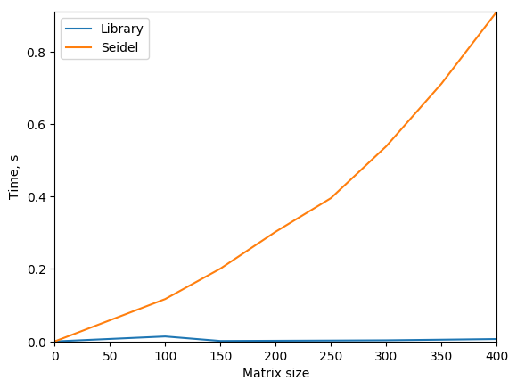

### Solution 2: Jacobi method
**Idea**: .<br>
**Result**: <br>
**Code:**
```python
# get new approximate answer
def jacobi(a, f, x):
    xnew = np.zeros(n)
    for i in range(n):
        s = 0
        for j in range(i - 1):
            s = s + a[i][j] * x[j]
        for j in range(i + 1, n):
            s = s + a[i][j] * x[j]
        xnew[i] = (f[i] - s) / a[i][i]
    return xnew

# choose suitable answer
def jacobi_solve(a, f):
    eps = 0.000001
    xnew = np.zeros(n)
    while True:
        x = xnew
        xnew = jacobi(a, f, x)
        if diff(x, xnew) <= eps:
            break
    return xnew
```
Running:
```
python3 jacobi.py
```
Comparison of the speed of the self-writing function and the library function:<br>
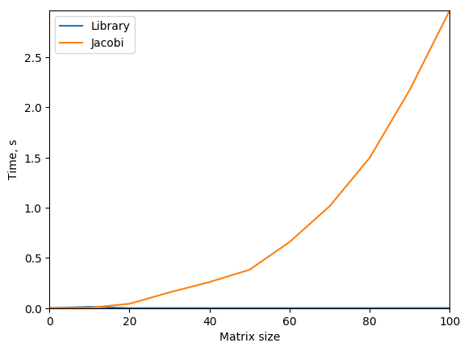

## H3: Interpolation and approximation
**Problem**: Given a grid of order n (*train.dat* file):<br>
<br>
Given a set of measurements (*train.ans* file):<br>
<br>
It is necessary to restore the value of function  in another set of points  (*test.dat* file) and save it to *test.ans* file.<br>
**Note**: every script can demonstrate you the result if you want. Use `-p` flag to see the plot. *Test points* are the *x* values (*test.dat* file) and the *y* values calculated for them (*test.ans* file).<br>
### Solution 1: linear interpolation
**Idea**:<br><br>
**Running**:
```
python3 linear.py -p
```
**Result**:<br>
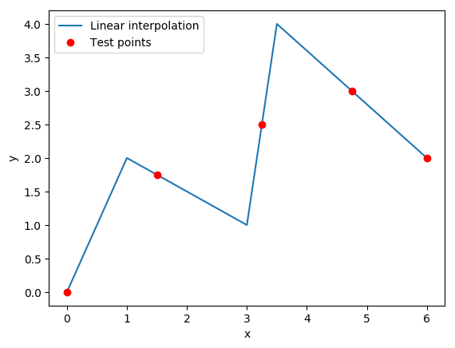
### Solution 2: Lagrange polynomial
**Idea**:<br>
Build  — the nth degree polynomial that will pass through the given points .<br>
Decompose on the basis of polynomial :<br>
<br>
<br>
**Running**:
```
python3 lagrange.py -p
```
**Result**:<br>
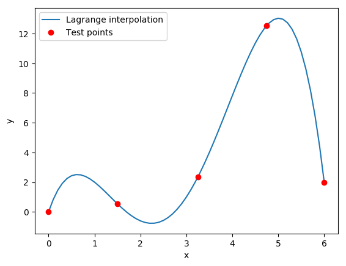
### Solution 3: spline interpolation (regular grid)
**Idea**:<br>
<br>
The vector of coefficients *B* is obtained from the solution of the system of equations *As = f* by the sweep method, and the remaining vectors of coefficients are obtained by the formulas:<br>
<br>
**Running**:
```
python3 spline.py -p
```
**Result**:<br>
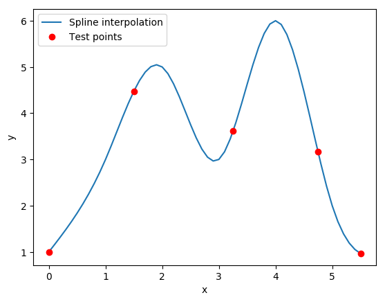
### Bonus task: spline interpolation (irregular grid)
**Idea**: similar to the previous task, but with modified formulas.<br>
<br>
Let's enter the notation:<br>
<br>
Continuity conditions:<br>
<br>
After substitution:<br>
<br>
Add a dummy element:<br>
<br>
Express *A* through *B*:<br>
<br>
Substitute *A* in the remaining equations:
<br>
Express *C* through *B*:<br>
<br>
Substitute and get a closed system for *B*:<br>
<br>
<br>
It is reduced to a system of linear equations of order *n + 1* with a three-diagonal matrix:
![equation](https://latex.codecogs.com/gif.latex?%5Cbegin%7Bpmatrix%7D%20b_0%20%26%200%20%26%200%20%26%200%20%26%20%5Cldots%20%26%200%20%26%200%20%26%200%20%5C%5C%20a_1%20%26%20b_1%20%26%20c_1%20%26%200%20%26%20%5Cldots%20%26%200%20%26%200%20%26%200%20%5C%5C%200%20%26%20a_2%20%26%20b_2%20%26%20c_2%20%26%20%5Cldots%20%26%200%20%26%200%20%26%200%20%5C%5C%200%20%26%200%20%26%20a_3%20%26%20b_3%20%26%20%5Cldots%20%26%200%20%26%200%20%26%200%20%5C%5C%20%5Cvdots%20%26%20%5Cvdots%20%26%20%5Cvdots%20%26%20%5Cvdots%20%26%20%5Cddots%20%26%20%5Cvdots%20%26%20%5Cvdots%20%26%20%5Cvdots%20%5C%5C%200%20%26%200%20%26%200%20%26%200%20%26%20%5Cldots%20%26%20b_%7Bn-2%7D%20%26%20c_%7Bn-2%7D%20%26%200%20%5C%5C%200%20%26%200%20%26%200%20%26%200%20%26%20%5Cldots%20%26%20a_%7Bn-1%7D%20%26%20b_%7Bn-1%7D%20%26%20c_%7Bn-1%7D%20%5C%5C%200%20%26%200%20%26%200%20%26%200%20%26%20%5Cldots%20%26%200%20%26%200%20%26%20b_n%20%5Cend%7Bpmatrix%7D%20%5Cbegin%7Bpmatrix%7D%20B_0%5C%5C%20B_1%5C%5C%20B_2%5C%5C%20B_3%5C%5C%20%5Cvdots%5C%5C%20B_%7Bn-2%7D%5C%5C%20B_%7Bn-1%7D%5C%5C%20B_n%20%5Cend%7Bpmatrix%7D%3D%5Cbegin%7Bpmatrix%7D%200%5C%5C%203y_%7Bxx%2C1%7D%5C%5C%203y_%7Bxx%2C2%7D%5C%5C%203y_%7Bxx%2C3%7D%5C%5C%20%5Cvdots%5C%5C%203y_%7Bxx%2Cn-2%7D%5C%5C%203y_%7Bxx%2Cn-1%7D%5C%5C%200%20%5Cend%7Bpmatrix%7D)<br>
where<br>
<br>
Diagonals:<br>
<br>
<br>
<br>
<br>
Solve system *As = f* by the sweep method and obtain the vector of coefficients *B*. The remaining coefficients are determined by the formulas:<br>
<br>
**Running**:
```
python3 irregular-spline.py -p
```
**Result**:<br>
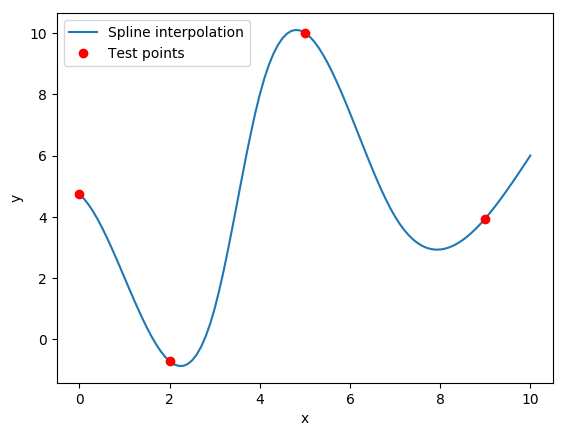
### Super bonus task: 2D splines
This is a two-dimensional spline interpolation using PyQt. Use `-p` flag to set line density (default value is 100). Run it and click on the window to see splines:
```
python3 spline_map.py
```
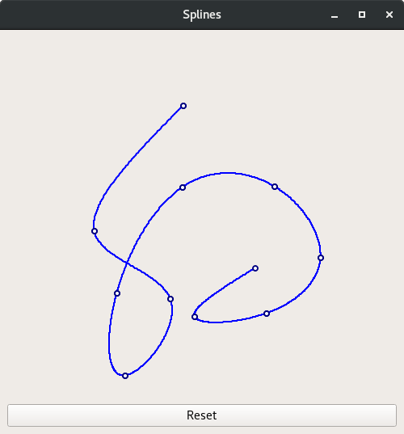

## H4: Heat and waves
### Heat (diffusion)
**Problem:** given a function of the initial profile  and the coefficient of thermal conductivity . Find the position of the profile at an arbitrary time .<br>
<br>
**Solution**: we will calculate the values for the matrix of size  using numerical methods. It is necessary after each update cycle to recalculate the values in all cells according to the formula:<br>
<br>
where the coefficients  satisfy the stability (Courant) condition:<br>
<br>
The script *heat.py* demonstrates the heat equation visually. Click the mouse button to "heat up" the plate on the screen. It will gradually cool.<br>
**Note 1**: since a long press of the mouse is difficult to implement technically using pure PyQt5 only, it is made artificially. During 10 update cycles (variable `heat_duration`), the program will generate the effect of external forces independently.<br>
**Note 2**: use the command line arguments to adjust the pressing force and change the size of the spot. The default pressing force is 2000 (variable `force`).<br><br>
Example:
```
python3 heat.py 500
```
The result with default value `force = 2000`:<br>

<br>
### Waves
**Problem:** given a function of the initial profile  and the transport velocity . Find the position of the profile at an arbitrary time .<br>
<br>
**Solution**: we will calculate the values for the matrix of size  using numerical methods. It is necessary after each update cycle to recalculate the values in all cells according to the formula (we will use 3 layers to calculate; upper index is a layer):<br>
<br>
where the coefficients  satisfy the stability (Courant) condition:<br>
<br>
The script *waves.py* demonstrates the transport equation visually. Click on the screen to make a wave! <br>
**Note**: use the command line arguments to adjust the pressing force and change the brightness of waves. The default pressing force is 400 (variable `force`).<br><br>
Example:
```
python3 waves.py 500
```
The result with default value `force = 400`:<br>
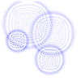

